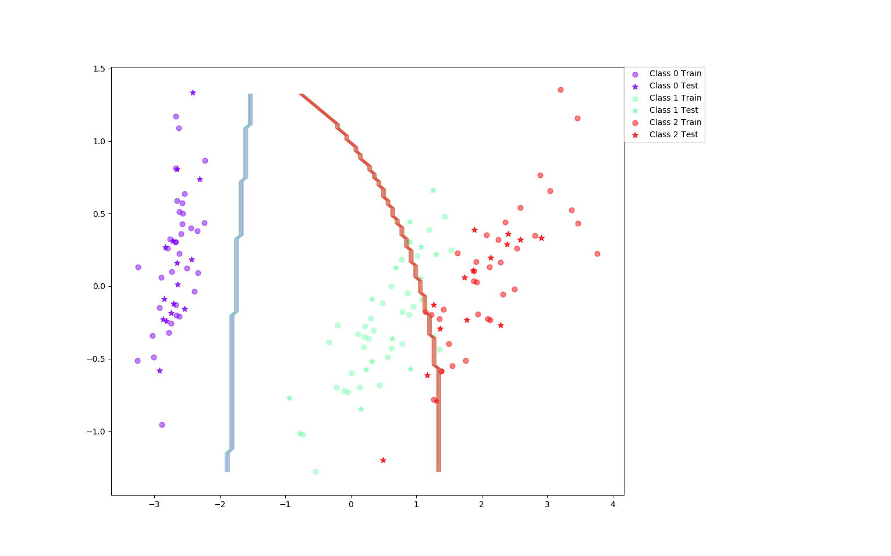
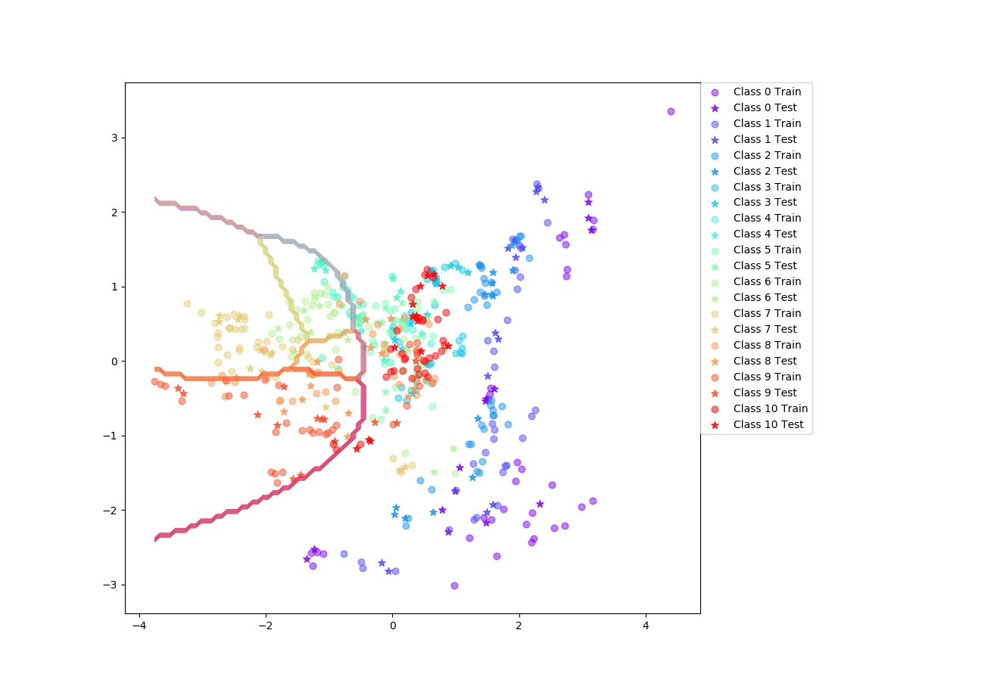

### Assignment 3

| Trial | Accuracy Iris | Accuracy Vowel |
| ----- | ----- | ----- |
| 0  | 84.4 | 29.9 |
| 10 | 93.3 | 35.1 |
| 20 | 91.1 | 36.4 |
| 30 | 86.7 | 31.8 |
| 40 | 88.9 | 34.4 |
| 50 | 91.1 | 30.5 |
| 60 | 86.7 | 25.3 |
| 70 | 86.7 | 38.3 |
| 80 | 86.7 | 33.8 |
| 90 | 93.3 | 29.9 |

| Class | Mean Acc (0.6) | Mean Acc (0.7) | Mean Acc (0.8) | SD (0.6) | SD (0.7) | SD (0.8) |
| ---- | ---- | ---- | ----- | ----- | ----- | ----- |
| Iris | 89.4 | 89.1 | 89.2 | 3.74 | 4.57 | 5.72 |
| Vowel | 32.6 |  32.8 | 32.6 | 2.9 | 2.74 | 2.78 |

#### When can a feature independance assumption be resonable and when not?

Features $x_i$ are (at least somewhat) independent
* Text document classification
* Medical diagnoses
* Spam detection ($x_i$ is the word that's classified for spam

Bad when the features are very similar. Will ofer inflate the importance of that specific feature since it will be calculated twice.

Unreliable when there are big differences in feature compared to training dataset. If the new attribute wasn't observed in training, then $P(x_i) = 0$
 
 #### How does the decision boundary look for the Iris dataset? How could one improve the classification results for this scenario by changing classifier or, alternatively, manipulating the data?

 Between class 1 and 2 it's very good and it's understandable. Between 1 and 2 however, it's quite bad and that can also be understood by looking at the two classes. Taking in concideration this is a *naive* approach by definition, it's not hard to understand since the classifier will classify much "harder".

Maybe a SVM as in last lab with polynomial kernel. Or adding more features that are more distinct from each other.

### Assignment 5

| Mean value / (split=0.7) | Iris Basic | Iris Boost | Vowel Basic | Vowel Boost | 
| ----- | ----- | ----- | ----- | ----- |
| Accuracy  | 89.0 | 94.1 | 64.7 | 80.2 |
| SD | 4.16 | 6.72 | 4.03 | 3.52 |