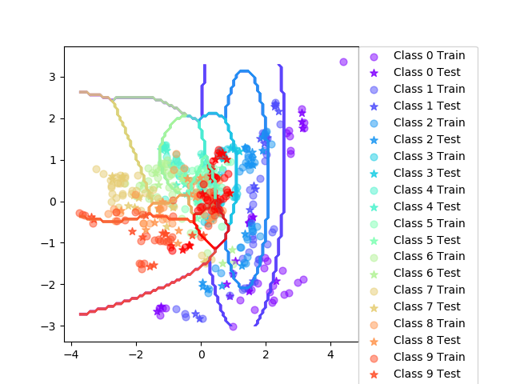
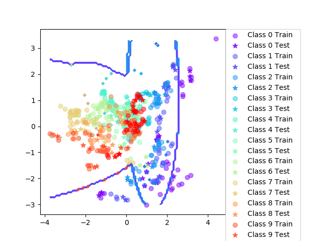

### Assignment 3

| Trial | Accuracy Iris | Accuracy Vowel |
| ----- | ----- | ----- |
| 0  | 84.4 | 29.9 |
| 10 | 93.3 | 35.1 |
| 20 | 91.1 | 36.4 |
| 30 | 86.7 | 31.8 |
| 40 | 88.9 | 34.4 |
| 50 | 91.1 | 30.5 |
| 60 | 86.7 | 25.3 |
| 70 | 86.7 | 38.3 |
| 80 | 86.7 | 33.8 |
| 90 | 93.3 | 29.9 |

| Class | Mean Acc (0.6) | Mean Acc (0.7) | Mean Acc (0.8) | SD (0.6) | SD (0.7) | SD (0.8) |
| ---- | ---- | ---- | ----- | ----- | ----- | ----- |
| Iris | 89.4 | 89.1 | 89.2 | 3.74 | 4.57 | 5.72 |
| Vowel | 32.6 |  32.8 | 32.6 | 2.9 | 2.74 | 2.78 |

 

#### When can a feature independance assumption be resonable and when not?

Features $x_i$ are (at least somewhat) independent
* Text document classification
* Medical diagnoses
* Spam detection ($x_i$ is the word that's classified for spam)

Bad when the features are very similar. Will often inflate the importance of that specific feature since it will be calculated twice.

Unreliable when there are big differences in features within the test set compared to training dataset. If the new attribute wasn't observed in training, then $P(x_i) = 0$
 
 #### How does the decision boundary look for the Iris dataset? How could one improve the classification results for this scenario by changing classifier or, alternatively, manipulating the data?

 Between class 1 and 2 it's very good and it's understandable. Between 1 and 2 however, it's quite bad and that can also be understood by looking at the two classes. Taking in concideration this is a *naive* approach by definition, it's not hard to understand since the classifier will classify much "harder".

Maybe a SVM as in last lab with polynomial kernel. Or adding more features that are more distinct from each other.

### Assignment 5

| Mean value / (split=0.7) | Iris Basic | Iris Boost | Vowel Basic | Vowel Boost | 
| ----- | ----- | ----- | ----- | ----- |
| Accuracy  | 89.0 | 94.1 | 64.7 | 80.2 |
| SD | 4.16 | 6.72 | 4.03 | 3.52 |

#### Is there any improvement in classification accuracy? Why/why not?

Yes. The accuracy is improving a lot, mostly for Vowel but also for Iris.
The boosting is focusing on the missclassified data points which makes it build a more accurate model. The variance is increasing since the training data is changing a lot even if a data point is far away from the class it's supposed to be in.

#### Plot the decision boundary of the boosted classifier on iris and compare it with that of the basic. What differences do you notice? Is the boundary of the boosted version more complex?

 

As can see in the pictures above, the Iris shows more complexness ahd have classified the points at class 2 better around the middle.

I'm not sure if you can call the Vowel boundary to be more complex, and it seems the class boundaries are quite overlapping.

#### Can we make up for not using a more advanced model in the basic classifier (e.g. independent features) by using boosting?

Definately, in certain cases.

### Assignment 6

#### Is there any improvement in classification accuracy? Why/why not?

| Mean value / (split=0.7) | Iris Dtree | Iris Dtree Boost | Vowel Dtree | Vowel Dtree Boost | 
| ----- | ----- | ----- | ----- | ----- |
| Accuracy  | 92.4 | 94.6 | 64.1 | 86.6 |
| SD | 3.71 | 3.65 | 4 | 3.01 |

#### Plot the decision boundary of the boosted classifier on iris and compare it with that of the basic. What differences do you notice? Is the boundary of the boosted version more complex?

 

 

#### Can we make up for not using a more advanced model in the basic classifier (e.g. independent features) by using boosting?

Boosting seems to increase the basic classifiers quality.
Increases the variance.

### Assignment 7

#### If you had to pick a classifier, naive Bayes or a decision tree or the boosted versions of these, which one would you pick? Motivate from the following criteria:

* **Outliers**
Boosted Bayes. Deals with outliers since SD is higher but have high accuracy as well.

* **Irrelevant inputs: part of the feature space is irrelevant**
High information gain is important when we have irrelevant inputs. Therefore decision trees are better in our minds. Probably non-boosted.

* **Predictive power**
Boosted increases accuracy for both of the classifiers.
Decision trees seems to have better accuracy.

* **Mixed types of data: binary, categorical or continuous features, etc.**
Binary decision trees unboosted. Bayes are better for continuous since it is good when the categories are independant. Boosting is making things nice.
Categorical works with both.

* **Scalability: the dimension of the data, D, is large or the number of instances N , is large, or both.**
Decision trees are waaaaaaay faster.
**15 rounds with T=10:**
Decision trees: 6.09s
Boosted trees: 64.20s