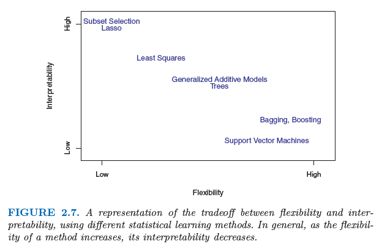
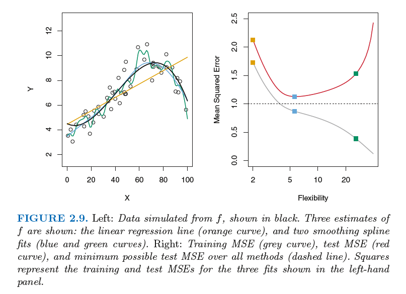

# Machine learning notes

## Dictionary

Word | Description
------- | -------
Inference | The process of making predictions by applying the trained model to unlabeled examples.
Quantative variables | Numerical values
Qualitative variables | Classes / categories
Bias | Bias is the difference between the average prediction of our model and the correct value which we are trying to predict. Model with high bias pays very little attention to the training data and oversimplifies the model. It always leads to high error on training and test data. Generally, *more flexible* methods result in *less bias*.
Variance | Irreductible. Variance is the variability of model prediction for a given data point or a value which tells us spread of our data. Model with high variance pays a lot of attention to training data and does not generalize on the data which it hasn’t seen before. Refers to the amount by which $\hat{f}$ would change if we cestimated it using a different training data set. High variance means that *small* changes in training data results in la*rge changes in $\hat{f}$*
Overfitting | Creating a model that matches the training data so closely that the model fails to make correct predictions on new data.

Type of ML-problem | Description | Example
---- | ---- | ---- |
Classification | Pick one of N labels (continuous) | Cats,dogs,horse
Regression | Predict numerical values (discrete) | Clich-through rate
Clustering | Group similar examples | most relevant documents (unsupervised)

## Estimate $f$

### Why Estimate $f?$

#### Inference

Restrictive models are more interpretable, therefore often better.
Can be easy to understand relationship between $Y$ and $X_1,X_2,X_p$.

#### Prediction

Flexible approaches can lead to complicated estimates of $f$. Being difficult to understand how an individual predictor is associated with the response.

### How Do We Estimate $f?$

### Parametric Methods

### Non-parametric Methods

#### Supervised Versus Unsupervised Learning

##### Supervised Learning

##### Unsupervised Learning

### Regression Versus Classification Problems

#### Regression

A regression model predicts continuous values. For example, regression models make predictions that answer questions like the following:

* What is the value of a house in California?

* What is the probability that a user will click on this ad?

#### Classification

A classification model predicts discrete values. For example, classification models make predictions that answer questions like the following:

* Is a given email message spam or not spam?

* Is this an image of a dog, a cat, or a hamster?

### Regression Problems

Often having a quantative response

#### Measuring quality of fit

##### Training MSE

Most commonly-used measure is *mean squared error* (MSE), given by 
$$
MSE = \frac{1}{n} \sum_{i=1}^{n}(y_i - \hat{f}(x_i))^2
$$
$\hat{f}(x_i)$ is prediction that $\hat{f}$ gives for the *i*th observation.
The MSE will be small if the predicted responses are very close to the true responses, and will be large if for some of the observations, the predicted and true responses differ substantially.

This is also known as *Training MSE* since it used training data to fit te model. In general we don't care how well the method wodks on the training data. Rather:

*"We are interested in the accuracy of hte predictions that we obtain when we apply our method to previously unseen test data."*

##### Test MSE

As model flexibility increases, training MSE will decrease, but the test MSE may not. This example is said to be *overfitting* the data, since its training MSE is decreasing and test MSE aren't.
This happens because our statistical learning procedure is working too hard to find patterns in the training data, and may be picking up some patterns that are just caused by random chance rather than by true properties of the unknown function *f*.

Computing test MSE is conciderably more difficult than training MSE because, usually, there are no test data available.

##### Example from book

*Suppose that we are interested test data in developing an algorithm to predict a stock’s price based on previous stock returns. We can train the method using stock returns from the past 6 months. But we don’t really care how well our method predicts last week’s stock price. We instead care about how well it will predict tomorrow’s price or next month’s price.*

### Classification Problems

Often having qualitative responses.

## The Bias-Variance Trade-Off

### Error Due to Bias

### Error Due to Variance

## Support Vector Machines

### Support Vector Classifiers

#### Support Vector Definition
When classifying with hyperplanes - support vectors are observations that lie directly on the margin, or on the wrong side of the margin for their class.
These are the only observations that affect the support vector classifier.
##### Bias-Variance Trade-Off
If you have *many observations involved* in determining the hyperplane ($C$ is large), you get *lower variance* since many observations are support vectors.
Small changes in the observations will *NOT* affect the hyperplane that much.

On the other hand: *few observations involved* in determining the same ($C$ is small), you get *higher variance* since few observations are support vectors.
